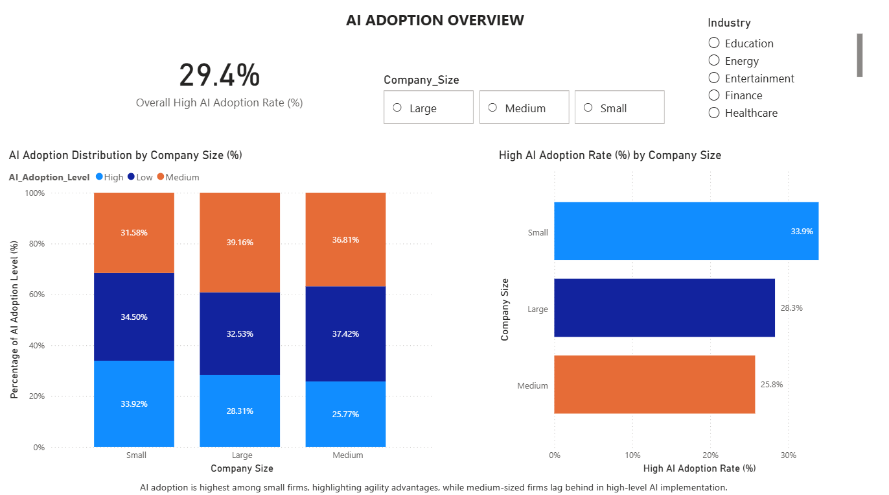
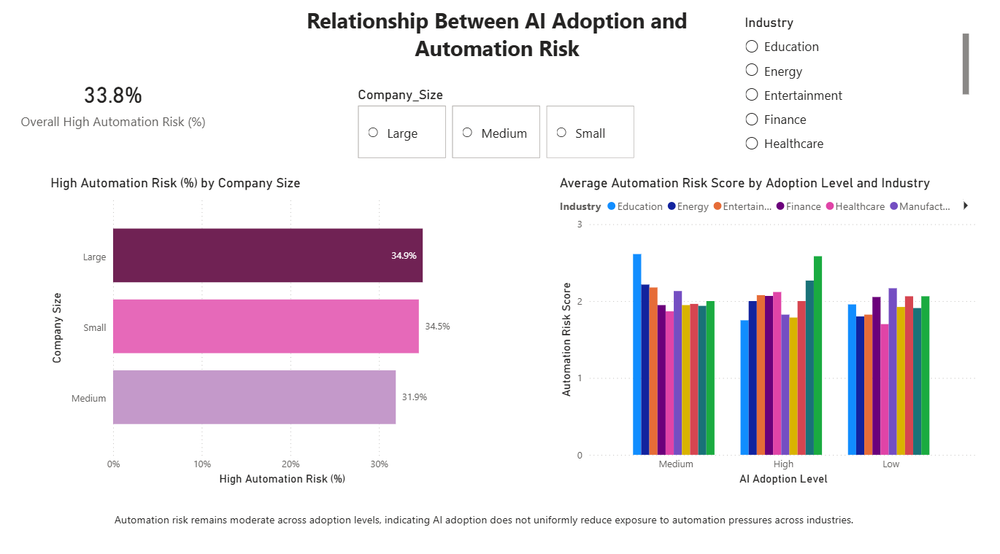
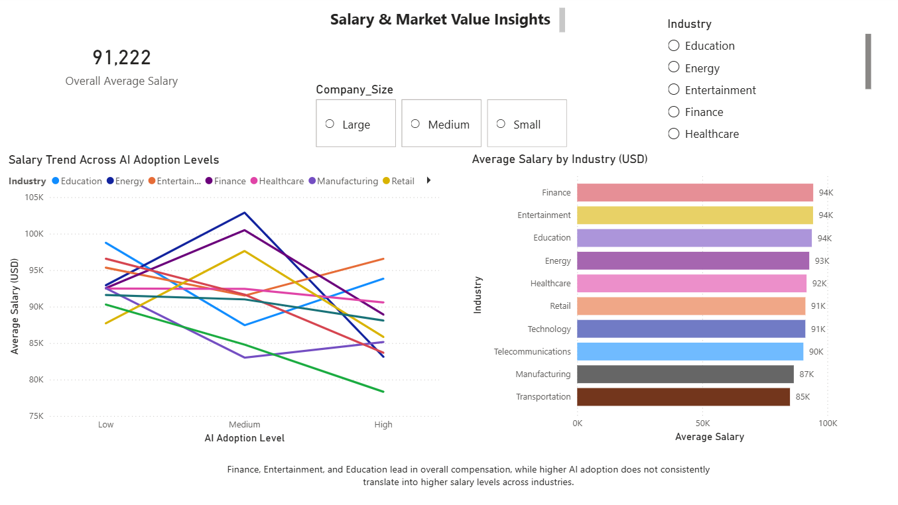
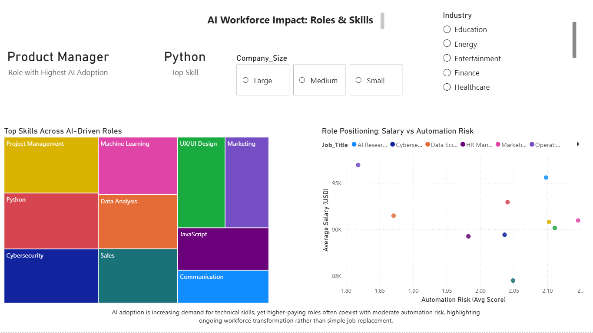

# AI Adoption Trends & Automation Risk Analysis (Power BI)

## Project Overview

This Business Intelligence project analyzes **AI adoption levels** and **automation risk** across industries, job roles, and company sizes.

The analysis focuses on:

- Variation in **AI adoption** across industries
- Differences in adoption by **company size**
- The relationship between AI integration and **automation exposure**
- Business implications of workforce transformation

---

## Business Question

- How does **AI adoption** differ across industries and company sizes?
- What is the relationship between **AI adoption** and automation risk?

---

## Tools & Technologies

- **Power BI**
- **DAX (Calculated Measures)**
- Data Modeling
- Data Visualization
- GitHub Documentation

---

## Dashboard Preview

### Executive KPI Overview



**Key elements:**

- Percentage of High AI Adoption
- Average Automation Risk
- Interactive slicers (Industry, Company Size, Adoption Level)
- Summary performance indicators

---

### Industry-Level Analysis



**Highlights:**

- AI adoption comparison across industries
- Automation risk differences by sector
- Industry-level maturity trends

---

### Company Size Impact



**Focus areas:**

- Adoption trends by organization size
- Enterprise-level AI integration patterns
- Distribution across small, medium, and large firms

---

### Automation Risk vs AI Adoption



**Insights from visualization:**

- Relationship between AI adoption and automation risk
- Role-based variation in exposure
- Strategic workforce implications

---

## Key DAX Measures

```DAX
% High Adoption =
DIVIDE(
    CALCULATE(COUNTROWS(Data), Data[AI_Adoption_Level] = "High"),
    COUNTROWS(Data)
)

Average Automation Risk =
AVERAGE(Data[Automation_Risk])
```

---

## Key Insights

- AI adoption is strongest in technology-focused industries.
- Medium-sized organizations show accelerated AI implementation.
- Automation exposure varies significantly across business functions.
- Higher AI adoption does not automatically eliminate workforce risk.

---

## Repository Structure

- `data/` → Raw dataset
- `dashboard/` → Power BI (.pbix) file
- `screenshots/` → Exported dashboard images

---

## Author

Samyak Pratap Shah  
MBA in Business Analytics
